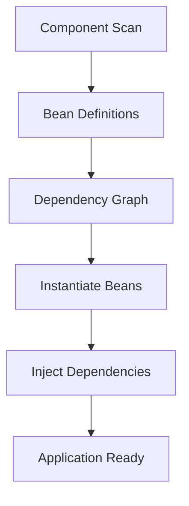

```mermaid
flowchart TD
  A[Component Scan] --> B[Bean Definitions]
  B --> C[Dependency Graph]
  C --> D[Instantiate Beans]
  D --> E[Inject Dependencies]
  E --> F[Application Ready]
```

### Best practice

> **Best Practice:** Use `@Configuration` classes for explicit wiring of critical infrastructure.

