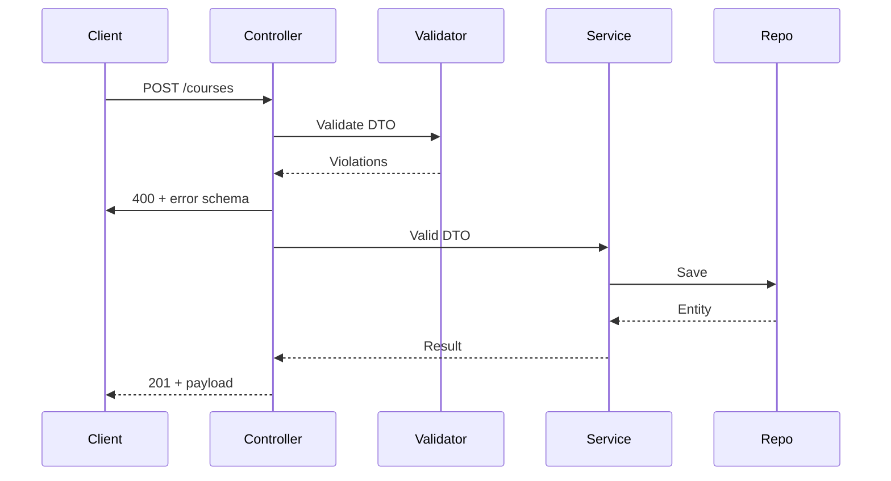

```mermaid
sequenceDiagram
  participant Client
  participant Controller
  participant Validator
  participant Service
  participant Repo
  Client->>Controller: POST /courses
  Controller->>Validator: Validate DTO
  Validator-->>Controller: Violations
  Controller->>Client: 400 + error schema
  Controller->>Service: Valid DTO
  Service->>Repo: Save
  Repo-->>Service: Entity
  Service-->>Controller: Result
  Controller-->>Client: 201 + payload
```

