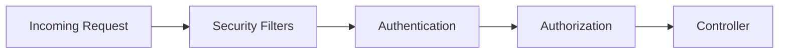

```mermaid
flowchart LR
  A[Incoming Request] --> B[Security Filters]
  B --> C[Authentication]
  C --> D[Authorization]
  D --> E[Controller]
```

### Best practice

> **Best Practice:** Keep public and private routes in separate filter chains when possible.

