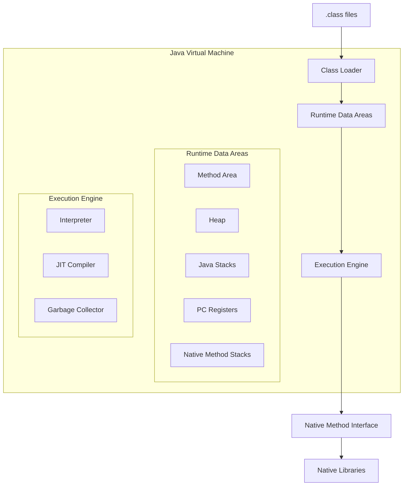
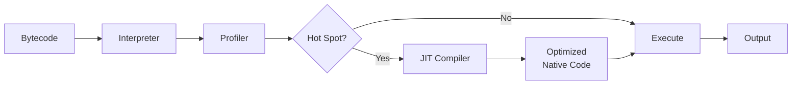
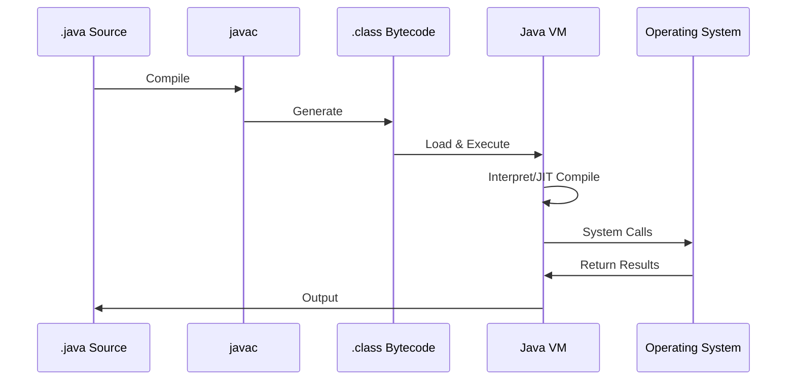
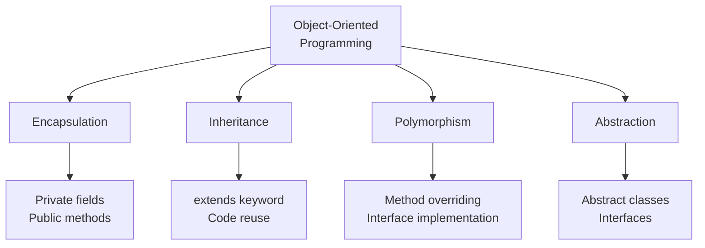

# The Modern Java Foundation – Java 21/25 Basics

- **Level**: Beginner
- **Env. notes**: Windows, Linux, Mac
- **Learning goals**:
  - Understand Java syntax and features for Java 21/25
  - Set up dev environment
  - Write and run basic Java code

---

## 1. Theory

### Key Java Concepts

#### Types and Variables
Java is a statically-typed language with both primitive and reference types:

**Primitive Types:**
- `byte`, `short`, `int`, `long` (integers)
- `float`, `double` (floating-point)
- `boolean` (true/false)
- `char` (single character)

**Reference Types:**
- Classes, Interfaces, Arrays, Enums
- String (immutable character sequence)

**Variable Declaration:**
```java
int count = 10;                    // Explicit type
var message = "Hello, Java 25!";   // Type inference (var keyword)
final double PI = 3.14159;         // Constant
```

#### Control Flow
**Conditional Statements:**
```java
// if-else
if (age >= 18) {
    System.out.println("Adult");
} else {
    System.out.println("Minor");
}

// Switch expressions (Java 14+)
String result = switch (day) {
    case MONDAY, FRIDAY -> "Workday";
    case SATURDAY, SUNDAY -> "Weekend";
    default -> "Unknown";
};
```

**Loops:**
```java
// for loop
for (int i = 0; i < 10; i++) {
    System.out.println(i);
}

// enhanced for loop
for (String name : names) {
    System.out.println(name);
}

// while loop
while (condition) {
    // code
}
```

#### Classes and Objects
Classes are blueprints for objects:
```java
public class Person {
    private String name;
    private int age;
    
    // Constructor
    public Person(String name, int age) {
        this.name = name;
        this.age = age;
    }
    
    // Methods
    public String getName() {
        return name;
    }
    
    public void greet() {
        System.out.println("Hello, I'm " + name);
    }
}
```

#### Interfaces
Interfaces define contracts that classes can implement:
```java
public interface Drawable {
    void draw();
    
    // Default method (Java 8+)
    default void display() {
        System.out.println("Displaying...");
        draw();
    }
}

public class Circle implements Drawable {
    @Override
    public void draw() {
        System.out.println("Drawing a circle");
    }
}
```

### New Features in Java 21/25

#### Records (Java 14+, finalized in Java 16)
Records are immutable data carriers with automatic implementations:
```java
// Before records
public class Point {
    private final int x;
    private final int y;
    
    public Point(int x, int y) {
        this.x = x;
        this.y = y;
    }
    
    public int x() { return x; }
    public int y() { return y; }
    
    // equals, hashCode, toString...
}

// With records
public record Point(int x, int y) {}
```

**Benefits:**
- Less boilerplate code
- Immutable by default
- Built-in equals(), hashCode(), and toString()
- Perfect for DTOs and value objects

#### Pattern Matching for switch (Java 21)
Enhanced switch with type patterns:
```java
public String formatValue(Object obj) {
    return switch (obj) {
        case Integer i -> "Integer: " + i;
        case String s -> "String: " + s;
        case Point(int x, int y) -> "Point at (" + x + ", " + y + ")";
        case null -> "Null value";
        default -> "Unknown type";
    };
}
```

#### Sealed Classes (Java 17)
Control which classes can extend or implement:
```java
public sealed interface Shape 
    permits Circle, Rectangle, Triangle {
    double area();
}

public final class Circle implements Shape {
    private final double radius;
    
    public Circle(double radius) {
        this.radius = radius;
    }
    
    @Override
    public double area() {
        return Math.PI * radius * radius;
    }
}
```

**Benefits:**
- Exhaustive pattern matching
- Better domain modeling
- Compiler-enforced inheritance control

#### Text Blocks (Java 15)
Multi-line string literals with proper formatting:
```java
String json = """
    {
        "name": "Spring Boot",
        "version": "4.0",
        "features": ["Virtual Threads", "Records"]
    }
    """;
```

#### Virtual Threads (Java 21)
Lightweight threads for high-throughput concurrent applications:
```java
// Traditional thread pool
ExecutorService executor = Executors.newFixedThreadPool(100);

// Virtual threads (Java 21)
ExecutorService virtualExecutor = Executors.newVirtualThreadPerTaskExecutor();

try (virtualExecutor) {
    for (int i = 0; i < 10_000; i++) {
        virtualExecutor.submit(() -> {
            // IO-heavy operation
            fetchDataFromAPI();
        });
    }
}
```

**Benefits:**
- Millions of threads with minimal overhead
- Simplified concurrency model
- Better resource utilization for IO-bound tasks

#### Sequenced Collections (Java 21)
New collection interfaces for ordered sequences:
```java
List<String> list = new ArrayList<>();
list.addFirst("first");
list.addLast("last");
String first = list.getFirst();
String last = list.getLast();
list.reversed(); // Returns reversed view
```

#### String Templates (Preview in Java 21, finalized in Java 25)
Type-safe string interpolation:
```java
String name = "Java";
int version = 25;
String message = STR."Welcome to \{name} \{version}!";
```

---

## 2. Visuals/Diagrams

### JVM Architecture


### JIT Compilation Process


### Basic Java Program Flow


### Object-Oriented Principles


---

## 3. Example Code

### Hello World
```java
// HelloWorld.java
public class HelloWorld {
    public static void main(String[] args) {
        System.out.println("Hello, Java 25!");
    }
}
```

**Compile and run:**
```bash
javac HelloWorld.java
java HelloWorld
```

### Class Example: Student Management
```java
// Student.java
public class Student {
    private final String id;
    private String name;
    private int age;
    private List<String> courses;
    
    public Student(String id, String name, int age) {
        this.id = id;
        this.name = name;
        this.age = age;
        this.courses = new ArrayList<>();
    }
    
    public void enrollCourse(String course) {
        courses.add(course);
        System.out.println(name + " enrolled in " + course);
    }
    
    public void displayInfo() {
        System.out.println("ID: " + id);
        System.out.println("Name: " + name);
        System.out.println("Age: " + age);
        System.out.println("Courses: " + courses);
    }
    
    // Getters and setters
    public String getId() { return id; }
    public String getName() { return name; }
    public void setName(String name) { this.name = name; }
    public int getAge() { return age; }
    public void setAge(int age) { this.age = age; }
    public List<String> getCourses() { return new ArrayList<>(courses); }
}
```

### Modern Class Example with Records
```java
// Course.java - Using Java 21 Records
public record Course(
    String code,
    String name,
    int credits,
    String instructor
) {
    // Compact constructor for validation
    public Course {
        if (credits < 0) {
            throw new IllegalArgumentException("Credits cannot be negative");
        }
    }
    
    // Additional methods
    public String getDescription() {
        return STR."\{name} (\{code}) - \{credits} credits by \{instructor}";
    }
}
```

### Interface Example: Repository Pattern
```java
// Repository.java
public interface Repository<T, ID> {
    T findById(ID id);
    List<T> findAll();
    T save(T entity);
    void delete(ID id);
    
    // Default method
    default boolean exists(ID id) {
        return findById(id) != null;
    }
}

// StudentRepository.java
public class StudentRepository implements Repository<Student, String> {
    private final Map<String, Student> storage = new HashMap<>();
    
    @Override
    public Student findById(String id) {
        return storage.get(id);
    }
    
    @Override
    public List<Student> findAll() {
        return new ArrayList<>(storage.values());
    }
    
    @Override
    public Student save(Student student) {
        storage.put(student.getId(), student);
        return student;
    }
    
    @Override
    public void delete(String id) {
        storage.remove(id);
    }
}
```

### Sealed Classes Example
```java
// Payment.java - Sealed hierarchy
public sealed interface Payment 
    permits CreditCardPayment, BankTransferPayment, CashPayment {
    double amount();
    String processPayment();
}

public final class CreditCardPayment implements Payment {
    private final double amount;
    private final String cardNumber;
    
    public CreditCardPayment(double amount, String cardNumber) {
        this.amount = amount;
        this.cardNumber = cardNumber;
    }
    
    @Override
    public double amount() { return amount; }
    
    @Override
    public String processPayment() {
        return STR."Processing credit card payment of $\{amount}";
    }
}

public final class BankTransferPayment implements Payment {
    private final double amount;
    private final String accountNumber;
    
    public BankTransferPayment(double amount, String accountNumber) {
        this.amount = amount;
        this.accountNumber = accountNumber;
    }
    
    @Override
    public double amount() { return amount; }
    
    @Override
    public String processPayment() {
        return STR."Processing bank transfer of $\{amount}";
    }
}

public final class CashPayment implements Payment {
    private final double amount;
    
    public CashPayment(double amount) {
        this.amount = amount;
    }
    
    @Override
    public double amount() { return amount; }
    
    @Override
    public String processPayment() {
        return STR."Processing cash payment of $\{amount}";
    }
}

// Usage with pattern matching
public class PaymentProcessor {
    public void process(Payment payment) {
        String result = switch (payment) {
            case CreditCardPayment cc -> 
                STR."Credit card: \{cc.processPayment()}";
            case BankTransferPayment bt -> 
                STR."Bank transfer: \{bt.processPayment()}";
            case CashPayment cash -> 
                STR."Cash: \{cash.processPayment()}";
        };
        System.out.println(result);
    }
}
```

### Virtual Threads Example
```java
// VirtualThreadsDemo.java
import java.util.concurrent.Executors;

public class VirtualThreadsDemo {
    public static void main(String[] args) {
        // Create virtual thread executor
        try (var executor = Executors.newVirtualThreadPerTaskExecutor()) {
            // Submit 10,000 tasks
            for (int i = 0; i < 10_000; i++) {
                final int taskId = i;
                executor.submit(() -> {
                    // Simulate IO operation
                    Thread.sleep(1000);
                    System.out.println(STR."Task \{taskId} completed");
                    return taskId;
                });
            }
        } catch (Exception e) {
            e.printStackTrace();
        }
        // Executor automatically shuts down with try-with-resources
    }
    
    // Create a single virtual thread
    public static void createVirtualThread() {
        Thread vThread = Thread.ofVirtual().start(() -> {
            System.out.println("Running in virtual thread: " + 
                Thread.currentThread());
        });
        
        try {
            vThread.join();
        } catch (InterruptedException e) {
            e.printStackTrace();
        }
    }
}
```

---

## 4. Best Practices & Useful Commands

### Development Environment Setup

#### Windows
```powershell
# Install Java 25 using Chocolatey
choco install temurin25

# Verify installation
java -version
javac -version

# Set JAVA_HOME (if not set automatically)
setx JAVA_HOME "C:\Program Files\Eclipse Adoptium\jdk-25.0.0.0-hotspot"
setx PATH "%PATH%;%JAVA_HOME%\bin"
```

#### macOS
```bash
# Install Java 25 using Homebrew
brew install openjdk@25

# Add to PATH
echo 'export PATH="/opt/homebrew/opt/openjdk@25/bin:$PATH"' >> ~/.zshrc
source ~/.zshrc

# Verify installation
java -version
javac -version
```

#### Linux
```bash
# Using SDKMAN (recommended)
curl -s "https://get.sdkman.io" | bash
source "$HOME/.sdkman/bin/sdkman-init.sh"
sdk install java 25-tem

# Using apt (Ubuntu/Debian)
sudo apt update
sudo apt install openjdk-25-jdk

# Verify installation
java -version
javac -version
```

### Essential CLI Commands

#### Compilation and Execution
```bash
# Compile a single file
javac MyClass.java

# Compile with source and target version
javac -source 25 -target 25 MyClass.java

# Compile multiple files
javac src/*.java -d bin/

# Run compiled class
java MyClass

# Run with specific classpath
java -cp bin MyClass

# Single-file source-code execution (Java 11+)
java MyClass.java  # No compilation needed!
```

#### JAR Operations
```bash
# Create a JAR file
jar cvf myapp.jar -C bin/ .

# Create executable JAR with manifest
jar cvfe myapp.jar Main -C bin/ .

# Extract JAR contents
jar xvf myapp.jar

# List JAR contents
jar tvf myapp.jar

# Run JAR
java -jar myapp.jar
```

#### Documentation
```bash
# Generate Javadoc
javadoc -d docs src/*.java

# Generate Javadoc with package info
javadoc -d docs -sourcepath src -subpackages com.example
```

### Maven Introduction

#### Installation
```bash
# Windows (Chocolatey)
choco install maven

# macOS (Homebrew)
brew install maven

# Linux (apt)
sudo apt install maven

# Verify
mvn -version
```

#### Essential Maven Commands
```bash
# Create new project from archetype
mvn archetype:generate -DgroupId=com.example -DartifactId=myapp \
    -DarchetypeArtifactId=maven-archetype-quickstart -DinteractiveMode=false

# Compile
mvn compile

# Run tests
mvn test

# Package (creates JAR/WAR)
mvn package

# Skip tests during package
mvn package -DskipTests

# Clean build artifacts
mvn clean

# Clean and package
mvn clean package

# Install to local repository
mvn install

# Run Spring Boot application
mvn spring-boot:run

# Display dependency tree
mvn dependency:tree

# Check for dependency updates
mvn versions:display-dependency-updates
```

#### Basic pom.xml for Java 25
```xml
<project xmlns="http://maven.apache.org/POM/4.0.0"
         xmlns:xsi="http://www.w3.org/2001/XMLSchema-instance"
         xsi:schemaLocation="http://maven.apache.org/POM/4.0.0 
         http://maven.apache.org/xsd/maven-4.0.0.xsd">
    <modelVersion>4.0.0</modelVersion>
    
    <groupId>com.example</groupId>
    <artifactId>java25-demo</artifactId>
    <version>1.0.0</version>
    
    <properties>
        <maven.compiler.source>25</maven.compiler.source>
        <maven.compiler.target>25</maven.compiler.target>
        <project.build.sourceEncoding>UTF-8</project.build.sourceEncoding>
    </properties>
    
    <dependencies>
        <!-- Add dependencies here -->
    </dependencies>
</project>
```

### Java Best Practices

#### Coding Standards
1. **Naming Conventions:**
   - Classes: PascalCase (`StudentRepository`)
   - Methods/Variables: camelCase (`findById`, `studentName`)
   - Constants: UPPER_SNAKE_CASE (`MAX_SIZE`, `DEFAULT_TIMEOUT`)
   - Packages: lowercase (`com.example.service`)

2. **Use Records for Data Transfer Objects:**
   ```java
   // Good
   public record UserDTO(String username, String email) {}
   
   // Avoid for simple DTOs
   public class UserDTO {
       private String username;
       private String email;
       // getters, setters, equals, hashCode...
   }
   ```

3. **Prefer Immutability:**
   ```java
   // Good
   public final class Config {
       private final String host;
       private final int port;
       
       public Config(String host, int port) {
           this.host = host;
           this.port = port;
       }
       
       public String host() { return host; }
       public int port() { return port; }
   }
   ```

4. **Use Optional for Null Safety:**
   ```java
   // Good
   public Optional<User> findUser(String id) {
       return Optional.ofNullable(users.get(id));
   }
   
   // Usage
   findUser("123")
       .ifPresent(user -> System.out.println(user.getName()));
   ```

5. **Leverage Pattern Matching:**
   ```java
   // Good (Java 21)
   if (obj instanceof String s) {
       System.out.println(s.toLowerCase());
   }
   
   // Old way
   if (obj instanceof String) {
       String s = (String) obj;
       System.out.println(s.toLowerCase());
   }
   ```

6. **Use Text Blocks for Multi-line Strings:**
   ```java
   // Good
   String sql = """
       SELECT id, name, email
       FROM users
       WHERE active = true
       ORDER BY name
       """;
   ```

7. **Exception Handling:**
   ```java
   // Good - Specific exceptions
   try {
       processFile(path);
   } catch (FileNotFoundException e) {
       log.error("File not found: {}", path, e);
   } catch (IOException e) {
       log.error("IO error processing file", e);
   }
   
   // Avoid - Generic catch
   try {
       processFile(path);
   } catch (Exception e) {
       // Too broad!
   }
   ```

---

## 5. Exercises

### Exercise 1: Write a Class - Library Management System
**Difficulty:** Beginner

**Task:** Create a `Book` class and a `Library` class with the following requirements:
- Book should have: title, author, ISBN, and availability status
- Library should be able to:
  - Add books
  - Search books by title
  - Check out a book (mark as unavailable)
  - Return a book (mark as available)

**Starter Code:**
```java
public class Book {
    // TODO: Add fields
    
    // TODO: Add constructor
    
    // TODO: Add getters/setters
    
    // TODO: Add method to mark as checked out
    
    // TODO: Add method to mark as returned
}

public class Library {
    // TODO: Add collection to store books
    
    // TODO: Add method to add book
    
    // TODO: Add method to find book by title
    
    // TODO: Add method to checkout book
    
    // TODO: Add method to return book
}
```

**Solution:**
```java
public record Book(
    String title,
    String author,
    String isbn,
    boolean available
) {
    public Book checkout() {
        if (!available) {
            throw new IllegalStateException("Book already checked out");
        }
        return new Book(title, author, isbn, false);
    }
    
    public Book returnBook() {
        return new Book(title, author, isbn, true);
    }
}

public class Library {
    private final Map<String, Book> books = new HashMap<>();
    
    public void addBook(Book book) {
        books.put(book.isbn(), book);
        System.out.println(STR."Added: \{book.title()}");
    }
    
    public Optional<Book> findByTitle(String title) {
        return books.values().stream()
            .filter(book -> book.title().equalsIgnoreCase(title))
            .findFirst();
    }
    
    public void checkoutBook(String isbn) {
        Book book = books.get(isbn);
        if (book == null) {
            System.out.println("Book not found");
            return;
        }
        
        Book checkedOut = book.checkout();
        books.put(isbn, checkedOut);
        System.out.println(STR."Checked out: \{book.title()}");
    }
    
    public void returnBook(String isbn) {
        Book book = books.get(isbn);
        if (book == null) {
            System.out.println("Book not found");
            return;
        }
        
        Book returned = book.returnBook();
        books.put(isbn, returned);
        System.out.println(STR."Returned: \{book.title()}");
    }
    
    public void listAvailableBooks() {
        books.values().stream()
            .filter(Book::available)
            .forEach(book -> System.out.println(STR."\{book.title()} by \{book.author()}"));
    }
}

// Main class to test
public class LibraryDemo {
    public static void main(String[] args) {
        Library library = new Library();
        
        library.addBook(new Book("Java 21 Guide", "John Doe", "123", true));
        library.addBook(new Book("Spring Boot 4", "Jane Smith", "456", true));
        
        library.listAvailableBooks();
        library.checkoutBook("123");
        library.listAvailableBooks();
        library.returnBook("123");
        library.listAvailableBooks();
    }
}
```

### Exercise 2: Loops and Data Processing
**Difficulty:** Beginner

**Task:** Write a program that:
1. Creates a list of numbers from 1 to 100
2. Filters even numbers
3. Calculates the sum of even numbers
4. Finds the maximum even number
5. Prints statistics

**Solution:**
```java
import java.util.List;
import java.util.stream.IntStream;

public class NumberProcessor {
    public static void main(String[] args) {
        // Generate numbers 1 to 100
        List<Integer> numbers = IntStream.rangeClosed(1, 100)
            .boxed()
            .toList();
        
        // Filter even numbers
        List<Integer> evenNumbers = numbers.stream()
            .filter(n -> n % 2 == 0)
            .toList();
        
        // Calculate sum
        int sum = evenNumbers.stream()
            .mapToInt(Integer::intValue)
            .sum();
        
        // Find maximum
        int max = evenNumbers.stream()
            .mapToInt(Integer::intValue)
            .max()
            .orElse(0);
        
        // Find average
        double average = evenNumbers.stream()
            .mapToInt(Integer::intValue)
            .average()
            .orElse(0.0);
        
        // Print statistics
        System.out.println("Statistics for Even Numbers (1-100)");
        System.out.println("=====================================");
        System.out.println(STR."Count: \{evenNumbers.size()}");
        System.out.println(STR."Sum: \{sum}");
        System.out.println(STR."Maximum: \{max}");
        System.out.println(STR."Average: \{average}");
        
        // Alternative: Traditional for loop approach
        int sumTraditional = 0;
        int maxTraditional = 0;
        int count = 0;
        
        for (int i = 1; i <= 100; i++) {
            if (i % 2 == 0) {
                sumTraditional += i;
                if (i > maxTraditional) {
                    maxTraditional = i;
                }
                count++;
            }
        }
        
        System.out.println("\nTraditional Loop Results:");
        System.out.println(STR."Count: \{count}");
        System.out.println(STR."Sum: \{sumTraditional}");
        System.out.println(STR."Maximum: \{maxTraditional}");
    }
}
```

### Exercise 3: Basic File I/O - Configuration Manager
**Difficulty:** Beginner

**Task:** Create a simple configuration manager that:
1. Reads configuration from a text file
2. Parses key-value pairs
3. Provides methods to get configuration values
4. Saves configuration back to file

**Solution:**
```java
import java.io.*;
import java.nio.file.*;
import java.util.*;

public record ConfigEntry(String key, String value) {}

public class ConfigManager {
    private final Map<String, String> config = new HashMap<>();
    private final Path configPath;
    
    public ConfigManager(String filename) {
        this.configPath = Paths.get(filename);
        loadConfig();
    }
    
    private void loadConfig() {
        try {
            if (!Files.exists(configPath)) {
                System.out.println("Config file not found, creating new one");
                Files.createFile(configPath);
                return;
            }
            
            List<String> lines = Files.readAllLines(configPath);
            for (String line : lines) {
                line = line.trim();
                if (line.isEmpty() || line.startsWith("#")) {
                    continue; // Skip empty lines and comments
                }
                
                String[] parts = line.split("=", 2);
                if (parts.length == 2) {
                    config.put(parts[0].trim(), parts[1].trim());
                }
            }
            System.out.println(STR."Loaded \{config.size()} configuration entries");
        } catch (IOException e) {
            System.err.println(STR."Error loading config: \{e.getMessage()}");
        }
    }
    
    public String get(String key) {
        return config.get(key);
    }
    
    public String get(String key, String defaultValue) {
        return config.getOrDefault(key, defaultValue);
    }
    
    public void set(String key, String value) {
        config.put(key, value);
    }
    
    public void save() {
        try {
            List<String> lines = new ArrayList<>();
            lines.add("# Configuration File");
            lines.add(STR."# Generated: \{java.time.LocalDateTime.now()}");
            lines.add("");
            
            for (Map.Entry<String, String> entry : config.entrySet()) {
                lines.add(STR."\{entry.getKey()}=\{entry.getValue()}");
            }
            
            Files.write(configPath, lines);
            System.out.println("Configuration saved successfully");
        } catch (IOException e) {
            System.err.println(STR."Error saving config: \{e.getMessage()}");
        }
    }
    
    public void display() {
        System.out.println("\nCurrent Configuration:");
        System.out.println("======================");
        config.forEach((key, value) -> 
            System.out.println(STR."\{key} = \{value}")
        );
    }
}

// Demo usage
public class ConfigDemo {
    public static void main(String[] args) {
        ConfigManager config = new ConfigManager("app.config");
        
        // Set some values
        config.set("app.name", "Spring Scholar");
        config.set("app.version", "1.0.0");
        config.set("db.host", "localhost");
        config.set("db.port", "5432");
        
        // Display configuration
        config.display();
        
        // Save to file
        config.save();
        
        // Read values
        String appName = config.get("app.name");
        String dbPort = config.get("db.port", "3306");
        
        System.out.println(STR."\nApplication: \{appName}");
        System.out.println(STR."Database Port: \{dbPort}");
    }
}
```

### Exercise 4: Advanced - Pattern Matching with Sealed Classes
**Difficulty:** Intermediate

**Task:** Create a calculator that uses sealed classes for operations and pattern matching for evaluation.

**Solution:**
```java
// Sealed hierarchy for operations
public sealed interface Operation 
    permits Add, Subtract, Multiply, Divide {
    double execute();
}

public record Add(double a, double b) implements Operation {
    @Override
    public double execute() {
        return a + b;
    }
}

public record Subtract(double a, double b) implements Operation {
    @Override
    public double execute() {
        return a - b;
    }
}

public record Multiply(double a, double b) implements Operation {
    @Override
    public double execute() {
        return a * b;
    }
}

public record Divide(double a, double b) implements Operation {
    public Divide {
        if (b == 0) {
            throw new IllegalArgumentException("Division by zero");
        }
    }
    
    @Override
    public double execute() {
        return a / b;
    }
}

public class Calculator {
    public String evaluate(Operation operation) {
        return switch (operation) {
            case Add(var a, var b) -> 
                STR."\{a} + \{b} = \{operation.execute()}";
            case Subtract(var a, var b) -> 
                STR."\{a} - \{b} = \{operation.execute()}";
            case Multiply(var a, var b) -> 
                STR."\{a} × \{b} = \{operation.execute()}";
            case Divide(var a, var b) -> 
                STR."\{a} ÷ \{b} = \{operation.execute()}";
        };
    }
    
    public static void main(String[] args) {
        Calculator calc = new Calculator();
        
        System.out.println(calc.evaluate(new Add(10, 5)));
        System.out.println(calc.evaluate(new Subtract(10, 5)));
        System.out.println(calc.evaluate(new Multiply(10, 5)));
        System.out.println(calc.evaluate(new Divide(10, 5)));
    }
}
```

---

## 6. Quiz

### Question 1: Java Syntax Basics
**Which keyword is used to declare a constant in Java?**
- A) const
- B) final
- C) static
- D) immutable

**Answer:** B) final

**Explanation:** In Java, the `final` keyword is used to declare constants. Once a final variable is initialized, its value cannot be changed.

---

### Question 2: Records
**What is the primary benefit of using records in Java?**
- A) Better performance
- B) Reduced boilerplate code for data carriers
- C) Mutable data structures
- D) Enhanced security

**Answer:** B) Reduced boilerplate code for data carriers

**Explanation:** Records automatically generate constructors, getters, equals(), hashCode(), and toString() methods, significantly reducing boilerplate code for simple data carriers.

---

### Question 3: Virtual Threads
**What is the main advantage of virtual threads in Java 21?**
- A) Faster CPU-bound computations
- B) Lower memory usage for all applications
- C) Ability to create millions of threads with minimal overhead
- D) Automatic garbage collection

**Answer:** C) Ability to create millions of threads with minimal overhead

**Explanation:** Virtual threads are lightweight threads that allow creating millions of concurrent threads with minimal memory overhead, particularly beneficial for IO-bound applications.

---

### Question 4: Sealed Classes
**What is the purpose of sealed classes in Java?**
- A) To improve performance
- B) To control which classes can extend or implement them
- C) To make classes immutable
- D) To enable multiple inheritance

**Answer:** B) To control which classes can extend or implement them

**Explanation:** Sealed classes restrict which classes can extend or implement them using the `permits` clause, providing better control over inheritance hierarchies.

---

### Question 5: Pattern Matching
**Which Java version introduced pattern matching for switch statements?**
- A) Java 11
- B) Java 17
- C) Java 21
- D) Java 25

**Answer:** C) Java 21

**Explanation:** Pattern matching for switch was finalized in Java 21, allowing type patterns and deconstruction patterns in switch expressions.

---

### Question 6: Text Blocks
**What is the correct syntax for text blocks in Java?**
- A) 'text'
- B) "text"
- C) """text"""
- D) '''text'''

**Answer:** C) """text"""

**Explanation:** Text blocks in Java use triple double-quotes (""") to delimit multi-line string literals.

---

### Question 7: JVM Architecture
**Which component of the JVM is responsible for optimizing bytecode at runtime?**
- A) Class Loader
- B) Garbage Collector
- C) JIT Compiler
- D) Interpreter

**Answer:** C) JIT Compiler

**Explanation:** The Just-In-Time (JIT) compiler optimizes frequently executed bytecode (hot spots) into native machine code at runtime for better performance.

---

### Question 8: Collections
**Which new interface was introduced in Java 21 for ordered sequences?**
- A) OrderedCollection
- B) SequencedCollection
- C) SortedCollection
- D) LinkedCollection

**Answer:** B) SequencedCollection

**Explanation:** Java 21 introduced the SequencedCollection interface to provide a uniform API for collections with a defined encounter order, including methods like addFirst(), addLast(), getFirst(), and getLast().

---

### Question 9: Maven
**Which Maven command compiles the source code and creates a JAR file?**
- A) mvn compile
- B) mvn build
- C) mvn package
- D) mvn install

**Answer:** C) mvn package

**Explanation:** The `mvn package` command compiles the code, runs tests, and packages the compiled code into a distributable format like JAR or WAR.

---

### Question 10: Best Practices
**Which injection type is recommended in modern Java/Spring applications?**
- A) Field injection
- B) Setter injection
- C) Constructor injection
- D) Interface injection

**Answer:** C) Constructor injection

**Explanation:** Constructor injection is recommended because it makes dependencies explicit, enables immutability, and makes testing easier.

---

## 7. Exam

### Exam: Build and Run a Sample Java Program Using Latest Version

**Time Limit:** 60 minutes  
**Passing Score:** 80%

#### Task Overview
Build a complete Java 25 application that demonstrates your understanding of modern Java features. Your application should be a **Contact Management System** with the following requirements:

#### Requirements

1. **Data Model (20 points)**
   - Create a `Contact` record with fields: id, name, email, phone, and address
   - Create a sealed `ContactType` hierarchy with: Personal, Business, Emergency
   - Implement proper validation in compact constructors

2. **Repository Layer (20 points)**
   - Implement a `ContactRepository` interface with CRUD operations
   - Create an in-memory implementation using a `Map`
   - Use `Optional` for null-safe returns
   - Implement search by name and type

3. **Service Layer (20 points)**
   - Create a `ContactService` class that uses the repository
   - Implement business logic for:
     - Adding contacts with validation
     - Updating contacts
     - Deleting contacts
     - Searching contacts
   - Use pattern matching where appropriate

4. **Application Features (20 points)**
   - Create a main class with a text-based menu
   - Implement all CRUD operations through the menu
   - Use text blocks for displaying menus
   - Handle exceptions gracefully

5. **Modern Java Features (20 points)**
   - Use records for data carriers
   - Use sealed classes for type hierarchies
   - Use pattern matching for switch
   - Use text blocks for multi-line strings
   - Use `var` for local variables where appropriate

#### Starter Template

```java
// ContactType.java - Sealed hierarchy
public sealed interface ContactType 
    permits Personal, Business, Emergency {
    String getDescription();
}

public record Personal() implements ContactType {
    @Override
    public String getDescription() {
        return "Personal Contact";
    }
}

public record Business(String company) implements ContactType {
    @Override
    public String getDescription() {
        return STR."Business Contact at \{company}";
    }
}

public record Emergency() implements ContactType {
    @Override
    public String getDescription() {
        return "Emergency Contact";
    }
}

// Contact.java - Record with validation
public record Contact(
    String id,
    String name,
    String email,
    String phone,
    ContactType type
) {
    public Contact {
        // TODO: Add validation
    }
}

// ContactRepository.java - Interface
public interface ContactRepository {
    // TODO: Define CRUD methods
}

// InMemoryContactRepository.java
public class InMemoryContactRepository implements ContactRepository {
    // TODO: Implement repository
}

// ContactService.java
public class ContactService {
    // TODO: Implement service layer
}

// ContactManagementApp.java - Main application
public class ContactManagementApp {
    public static void main(String[] args) {
        // TODO: Implement menu-driven application
    }
}
```

#### Sample Solution

```java
// ContactType.java
public sealed interface ContactType 
    permits Personal, Business, Emergency {
    String getDescription();
}

public record Personal() implements ContactType {
    @Override
    public String getDescription() {
        return "Personal Contact";
    }
}

public record Business(String company) implements ContactType {
    public Business {
        if (company == null || company.isBlank()) {
            throw new IllegalArgumentException("Company name cannot be blank");
        }
    }
    
    @Override
    public String getDescription() {
        return STR."Business Contact at \{company}";
    }
}

public record Emergency() implements ContactType {
    @Override
    public String getDescription() {
        return "Emergency Contact";
    }
}

// Contact.java
public record Contact(
    String id,
    String name,
    String email,
    String phone,
    ContactType type
) {
    public Contact {
        if (id == null || id.isBlank()) {
            throw new IllegalArgumentException("ID cannot be blank");
        }
        if (name == null || name.isBlank()) {
            throw new IllegalArgumentException("Name cannot be blank");
        }
        if (email == null || !email.contains("@")) {
            throw new IllegalArgumentException("Invalid email");
        }
        if (type == null) {
            throw new IllegalArgumentException("Contact type cannot be null");
        }
    }
    
    public String getFormattedInfo() {
        return STR."""
            ID: \{id}
            Name: \{name}
            Email: \{email}
            Phone: \{phone}
            Type: \{type.getDescription()}
            """;
    }
}

// ContactRepository.java
public interface ContactRepository {
    Optional<Contact> findById(String id);
    List<Contact> findAll();
    List<Contact> findByName(String name);
    List<Contact> findByType(ContactType type);
    Contact save(Contact contact);
    boolean delete(String id);
    int count();
}

// InMemoryContactRepository.java
public class InMemoryContactRepository implements ContactRepository {
    private final Map<String, Contact> storage = new ConcurrentHashMap<>();
    
    @Override
    public Optional<Contact> findById(String id) {
        return Optional.ofNullable(storage.get(id));
    }
    
    @Override
    public List<Contact> findAll() {
        return new ArrayList<>(storage.values());
    }
    
    @Override
    public List<Contact> findByName(String name) {
        return storage.values().stream()
            .filter(contact -> contact.name().toLowerCase()
                .contains(name.toLowerCase()))
            .toList();
    }
    
    @Override
    public List<Contact> findByType(ContactType type) {
        return storage.values().stream()
            .filter(contact -> contact.type().getClass()
                .equals(type.getClass()))
            .toList();
    }
    
    @Override
    public Contact save(Contact contact) {
        storage.put(contact.id(), contact);
        return contact;
    }
    
    @Override
    public boolean delete(String id) {
        return storage.remove(id) != null;
    }
    
    @Override
    public int count() {
        return storage.size();
    }
}

// ContactService.java
public class ContactService {
    private final ContactRepository repository;
    
    public ContactService(ContactRepository repository) {
        this.repository = repository;
    }
    
    public Contact addContact(String id, String name, String email, 
                             String phone, ContactType type) {
        var contact = new Contact(id, name, email, phone, type);
        return repository.save(contact);
    }
    
    public Optional<Contact> getContact(String id) {
        return repository.findById(id);
    }
    
    public List<Contact> getAllContacts() {
        return repository.findAll();
    }
    
    public List<Contact> searchByName(String name) {
        return repository.findByName(name);
    }
    
    public boolean deleteContact(String id) {
        return repository.delete(id);
    }
    
    public String getContactSummary(Contact contact) {
        return switch (contact.type()) {
            case Personal p -> 
                STR."Personal: \{contact.name()} (\{contact.email()})";
            case Business(var company) -> 
                STR."Business: \{contact.name()} at \{company} (\{contact.email()})";
            case Emergency e -> 
                STR."Emergency: \{contact.name()} (\{contact.phone()})";
        };
    }
    
    public int getTotalContacts() {
        return repository.count();
    }
}

// ContactManagementApp.java
import java.util.Scanner;

public class ContactManagementApp {
    private final ContactService service;
    private final Scanner scanner;
    
    public ContactManagementApp() {
        this.service = new ContactService(new InMemoryContactRepository());
        this.scanner = new Scanner(System.in);
    }
    
    public void run() {
        boolean running = true;
        
        while (running) {
            displayMenu();
            var choice = scanner.nextLine().trim();
            
            running = switch (choice) {
                case "1" -> { addContact(); yield true; }
                case "2" -> { viewAllContacts(); yield true; }
                case "3" -> { searchContact(); yield true; }
                case "4" -> { deleteContact(); yield true; }
                case "5" -> { displayStatistics(); yield true; }
                case "6" -> { System.out.println("Goodbye!"); yield false; }
                default -> { 
                    System.out.println("Invalid choice. Try again."); 
                    yield true; 
                }
            };
        }
        
        scanner.close();
    }
    
    private void displayMenu() {
        String menu = """
            
            ╔════════════════════════════════════╗
            ║   Contact Management System        ║
            ╠════════════════════════════════════╣
            ║  1. Add Contact                    ║
            ║  2. View All Contacts              ║
            ║  3. Search Contact                 ║
            ║  4. Delete Contact                 ║
            ║  5. Statistics                     ║
            ║  6. Exit                           ║
            ╚════════════════════════════════════╝
            
            Enter your choice: """;
        System.out.print(menu);
    }
    
    private void addContact() {
        try {
            System.out.print("ID: ");
            var id = scanner.nextLine().trim();
            
            System.out.print("Name: ");
            var name = scanner.nextLine().trim();
            
            System.out.print("Email: ");
            var email = scanner.nextLine().trim();
            
            System.out.print("Phone: ");
            var phone = scanner.nextLine().trim();
            
            System.out.println("Type: 1=Personal, 2=Business, 3=Emergency");
            var typeChoice = scanner.nextLine().trim();
            
            ContactType type = switch (typeChoice) {
                case "1" -> new Personal();
                case "2" -> {
                    System.out.print("Company: ");
                    var company = scanner.nextLine().trim();
                    yield new Business(company);
                }
                case "3" -> new Emergency();
                default -> throw new IllegalArgumentException("Invalid type");
            };
            
            var contact = service.addContact(id, name, email, phone, type);
            System.out.println(STR."✓ Contact added: \{contact.name()}");
        } catch (Exception e) {
            System.out.println(STR."✗ Error: \{e.getMessage()}");
        }
    }
    
    private void viewAllContacts() {
        var contacts = service.getAllContacts();
        
        if (contacts.isEmpty()) {
            System.out.println("No contacts found.");
            return;
        }
        
        System.out.println("\n=== All Contacts ===");
        contacts.forEach(contact -> 
            System.out.println(service.getContactSummary(contact))
        );
    }
    
    private void searchContact() {
        System.out.print("Enter name to search: ");
        var name = scanner.nextLine().trim();
        
        var results = service.searchByName(name);
        
        if (results.isEmpty()) {
            System.out.println("No contacts found.");
            return;
        }
        
        System.out.println(STR."\nFound \{results.size()} contact(s):");
        results.forEach(contact -> 
            System.out.println(contact.getFormattedInfo())
        );
    }
    
    private void deleteContact() {
        System.out.print("Enter contact ID to delete: ");
        var id = scanner.nextLine().trim();
        
        if (service.deleteContact(id)) {
            System.out.println("✓ Contact deleted successfully");
        } else {
            System.out.println("✗ Contact not found");
        }
    }
    
    private void displayStatistics() {
        var total = service.getTotalContacts();
        System.out.println(STR."\nTotal Contacts: \{total}");
    }
    
    public static void main(String[] args) {
        System.out.println("Welcome to Contact Management System");
        System.out.println("Built with Java 25 Modern Features\n");
        
        var app = new ContactManagementApp();
        app.run();
    }
}
```

#### Build and Run Instructions

**Create the project:**
```bash
mkdir contact-management
cd contact-management
mkdir -p src/main/java/com/example/contacts
```

**Create pom.xml:**
```xml
<?xml version="1.0" encoding="UTF-8"?>
<project xmlns="http://maven.apache.org/POM/4.0.0"
         xmlns:xsi="http://www.w3.org/2001/XMLSchema-instance"
         xsi:schemaLocation="http://maven.apache.org/POM/4.0.0 
         http://maven.apache.org/xsd/maven-4.0.0.xsd">
    <modelVersion>4.0.0</modelVersion>
    
    <groupId>com.example</groupId>
    <artifactId>contact-management</artifactId>
    <version>1.0.0</version>
    
    <properties>
        <maven.compiler.source>25</maven.compiler.source>
        <maven.compiler.target>25</maven.compiler.target>
        <maven.compiler.release>25</maven.compiler.release>
        <project.build.sourceEncoding>UTF-8</project.build.sourceEncoding>
    </properties>
    
    <build>
        <plugins>
            <plugin>
                <groupId>org.apache.maven.plugins</groupId>
                <artifactId>maven-compiler-plugin</artifactId>
                <version>3.11.0</version>
                <configuration>
                    <compilerArgs>
                        <arg>--enable-preview</arg>
                    </compilerArgs>
                </configuration>
            </plugin>
        </plugins>
    </build>
</project>
```

**Compile and run:**
```bash
# Compile
mvn clean compile

# Run
mvn exec:java -Dexec.mainClass="com.example.contacts.ContactManagementApp"

# Or package and run JAR
mvn package
java -jar target/contact-management-1.0.0.jar
```

#### Grading Rubric

- **Data Model (20 points)**
  - Correct use of records: 8 points
  - Proper sealed class hierarchy: 7 points
  - Validation logic: 5 points

- **Repository Layer (20 points)**
  - Complete interface: 5 points
  - Correct implementation: 10 points
  - Use of Optional: 5 points

- **Service Layer (20 points)**
  - Business logic implementation: 10 points
  - Pattern matching usage: 5 points
  - Error handling: 5 points

- **Application Features (20 points)**
  - Working menu system: 8 points
  - All CRUD operations: 10 points
  - User experience: 2 points

- **Modern Java Features (20 points)**
  - Records: 5 points
  - Sealed classes: 5 points
  - Pattern matching: 5 points
  - Text blocks: 3 points
  - Other features (var, etc.): 2 points

---

## 8. Content Customization

### Beginner Track

**Focus Areas:**
- Java syntax fundamentals
- Basic data types and control structures
- Simple class and object creation
- Introduction to OOP concepts
- Basic file I/O
- Simple Maven commands

**Recommended Path:**
1. Start with "Theory" section - focus on types, variables, and control flow
2. Work through "Hello World" and simple class examples
3. Complete Exercise 1 (Library Management)
4. Complete Exercise 2 (Loops and Data Processing)
5. Take the Quiz
6. Skip advanced features (sealed classes, pattern matching)

**Time Estimate:** 8-10 hours

### Advanced Track

**Focus Areas:**
- Modern Java 21/25 features
- Records and sealed classes
- Pattern matching
- Virtual threads
- Advanced design patterns
- Performance optimization
- Production-ready code practices

**Recommended Path:**
1. Skim basic theory, focus on "New Features in Java 21/25"
2. Study all diagram sections (JVM, JIT, etc.)
3. Focus on modern code examples (records, sealed classes, pattern matching)
4. Complete Exercise 3 (File I/O with modern features)
5. Complete Exercise 4 (Pattern Matching with Sealed Classes)
6. Complete the full Exam project
7. Experiment with virtual threads in the contact management system

**Time Estimate:** 6-8 hours

### Learning Style Customizations

#### Visual Learners
- Focus heavily on section 2 (Visuals/Diagrams)
- Use IntelliJ IDEA's visual debugging tools
- Draw out class hierarchies on paper
- Watch supplementary video tutorials

#### Hands-On Learners
- Start with Exercise 1 immediately
- Modify example code extensively
- Build variations of the exam project
- Create your own mini-projects

#### Reading/Theory Learners
- Deep dive into section 1 (Theory)
- Read Oracle's official Java documentation
- Study the Java Language Specification
- Take detailed notes on each concept

### Environment-Specific Notes

#### Windows Users
- Use PowerShell or Windows Terminal
- Consider WSL2 for Linux-like experience
- Install Git Bash for Unix commands
- Use IntelliJ IDEA or Eclipse

#### macOS Users
- Leverage Homebrew for installations
- Use Terminal or iTerm2
- Consider IntelliJ IDEA or VS Code
- Xcode command-line tools may be helpful

#### Linux Users
- Use native package managers
- Any modern terminal will work
- Consider IntelliJ IDEA or VS Code
- Docker available for containerization experiments

### Next Steps

After completing this chapter, you should be ready for:
- **PH1-L2:** Virtual Threads (deep dive)
- **PH1-L3:** Functional Java (streams, lambdas, functional interfaces)
- **PH1-L4:** Build Tools (Maven/Gradle advanced topics)
- **PH2-L1:** IoC & Dependency Injection (Spring Framework basics)

### Additional Resources

**Official Documentation:**
- [Oracle Java SE Documentation](https://docs.oracle.com/en/java/javase/21/)
- [OpenJDK](https://openjdk.org/)
- [Java Language Specification](https://docs.oracle.com/javase/specs/)

**Community Resources:**
- [Java Subreddit](https://reddit.com/r/java)
- [Stack Overflow Java Tag](https://stackoverflow.com/questions/tagged/java)
- [Baeldung Java Tutorials](https://www.baeldung.com/java-tutorial)

**Books:**
- "Effective Java" by Joshua Bloch
- "Java: The Complete Reference" by Herbert Schildt
- "Modern Java in Action" by Raoul-Gabriel Urma

---

**End of Chapter: The Modern Java Foundation – Java 21/25 Basics**
